# OUC Computer Network Lab Report


**Student ID:** `23020036058`    **Name:** `Xuebin Mao`    

**Major:** `Computer Science and Technology (Sino-Foreign)`    **Grade:** `2023` 


------


## I. Analyze the solution effectiveness for each item with examples, combining code and LOG files. (17 points) 

### *A. RDT 2.0*

Assuming bit errors occur during transmission in the underlying channel, RDT 2.0 ignores errors in ACK/NAK packets.

#### *1) Code*

##### *a) CheckSum.java*

*computeChkSum Method:*

```java
/*
 * Calculate the TCP packet checksum: only validate seq, ack, and sum in the TCP
 * header, as well as the TCP data field
 */
public static short computeChkSum(TCP_PACKET tcpPack) {
    long checkSum = 0;
    TCP_HEADER Htmp = tcpPack.getTcpH();
    int data[] = tcpPack.getTcpS().getData();

    int Seq = Htmp.getTh_seq();
    int Ack = Htmp.getTh_ack();

    checkSum = (Seq >>> 16) + (Seq & 0xffff) + (Ack >>> 16) + (Ack & 0xffff);// + Htmp.getTh_sum();
    for (int i = 0; i < data.length; i++) {
        checkSum += ((data[i] >>> 16) + (data[i] & 0xffff));
    }
    while ((checkSum >>> 16) > 0) {
        checkSum = (checkSum & 0xffff) + (checkSum >>> 16);
    }
    checkSum = ~checkSum;

    return (short) checkSum;
}
```

I chose to use the checksum method to calculate the checksum. According to the requirements, the `seq`, `ack`, and `data` fields are used for calculation. To prevent data overflow, `checkSum` is set to `long` type. The 32-bit `Seq`, `ack`, and `data` fields are split into two 16-bit fields, summed, wrapped around, and then inverted. Finally, it is cast to `short` type (taking 16 bits) to serve as the packet's checksum.

##### *b) TCP_Sender.java*

*waitACK Method:*

```java
@Override
// Needs modification
public void waitACK() {
    // Loop check ackQueue
    // Loop check confirmation number queue for newly received ACK
    while (flag == 0) {
        if (!ackQueue.isEmpty()) {
            int currentAck = ackQueue.poll();
            // System.out.println("CurrentAck: "+currentAck);
            if (currentAck == tcpPack.getTcpH().getTh_seq()) {
                System.out.println("Clear: " + tcpPack.getTcpH().getTh_seq());
                flag = 1;
                // break;
            } else {
                System.out.println("Retransmit: " + tcpPack.getTcpH().getTh_seq());
                udt_send(tcpPack);
                flag = 0;
            }
        }
    }
}
```

To optimize the code structure, the original method was modified. The infinite loop originally in `rdt_send` was moved into `waitACK`, and `rdt_send` was changed to call `waitACK`. This implements the required loop for checking ACKs: if the ACK for the current packet is received, the loop breaks and waiting stops; otherwise, the packet is retransmitted, and waiting continues.

*rdt_send Method:*

```java
// Wait for ACK packet
waitACK();
// while (flag == 0);
```

The original `while (flag == 0);` was commented out and replaced with a direct call to `waitACK`.

*recv Method:*

```java
// Process ACK packet
// waitACK();
```

`waitACK();` was commented out for the same reason as above.

##### *c) TCP_Receiver.java*

*rdt_recv Method:*

```java
int sequence_cur = recvPack.getTcpH().getTh_seq();

if (sequence_cur == sequence) {
    // Insert the correctly received and ordered data into the data queue, ready for
    // delivery
    dataQueue.add(recvPack.getTcpS().getData());
    sequence += recvPack.getTcpS().getData().length;
} else {
    System.out.println("Duplicate packet, Seq =" + recvPack.getTcpH().getTh_seq());
}
```

To resolve the issue of the receiver receiving duplicate packets, a sequence number check was added. If the sequence number does not match the expected sequence number, the receiver discards the duplicate packet, preventing data duplication.

---

#### *2) Log Analysis*

For RDT 2.0, the sender cannot determine if an ACK/NAK is corrupted. Therefore, the receiver's `eFlag` is set to 0, indicating an error-free channel. The sender's `waitACK` method relies on a trusted sequence number to distinguish between ACK and NAK. For the receiver, checksums are used to determine if a packet is corrupted. Therefore, the sender's `eFlag` is set to 1, causing bit errors in packets sent from the sender to the receiver.

The log file of the run results is shown above. There are a total of 1008 lines, with a success rate of 99.21% and a total of 8 exceptions.

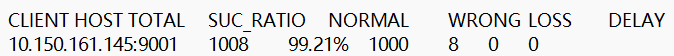

There is only one type of error: bit errors occur in packets sent from the sender to the receiver.

Sender Perspective (WRONG):

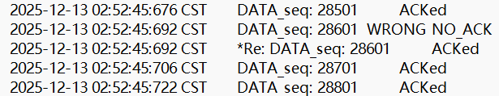

Receiver Perspective:

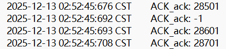

It can be seen that the receiver informs the sender that the received packet has a bit error by returning an ACK with `seq=-1` (i.e., a NAK). Consequently, the sender displays `WRONG NO_ACK`, then retransmits, and subsequently receives the ACK. This concludes the implementation of RDT 2.0.

------

### *B. RDT 2.2*

Addressing the issue where ACKs/NAKs can suffer bit errors, RDT 2.2 uses only numbered ACKs to indicate which data packet is being confirmed. If an ACK is duplicated, the packet must be retransmitted (equivalent to receiving a NAK).

#### *1) Code*

***a) TCP_Sender.java***

*recv Method:*

```java
public void recv(TCP_PACKET recvPack) {

        if(CheckSum.computeChkSum(recvPack)==recvPack.getTcpH().getTh_sum()) {
            System.out.println("Receive ACK Number： " + recvPack.getTcpH().getTh_ack());			
            ackQueue.add(recvPack.getTcpH().getTh_ack());
            System.out.println();			
        }else{
            System.out.println("Receive error ACK");
            ackQueue.add(-1);
            System.out.println();
        }
	}
}
```

Checksum verification was added to determine if the ACK has a bit error. If the verification fails, the abnormal ACK is added to the ACK queue with a sequence number of -1, indicating an exception.

#####  *b) TCP_Receiver.java* 

*Public area:*

```java
int lastack = -1;
```

*rdt_recv Method:*

```java
if (CheckSum.computeChkSum(recvPack) == recvPack.getTcpH().getTh_sum()) {

    int sequence_cur = recvPack.getTcpH().getTh_seq();

    // Generate ACK packet (set acknowledgment number)
    tcpH.setTh_ack(sequence_cur);
    ackPack = new TCP_PACKET(tcpH, tcpS, recvPack.getSourceAddr());
    tcpH.setTh_sum(CheckSum.computeChkSum(ackPack));
    // Reply ACK packet
    reply(ackPack);

    if (sequence_cur == sequence) {
        // Insert the correctly received and ordered data into the data queue, ready for
        // delivery
        dataQueue.add(recvPack.getTcpS().getData());
        lastack = sequence;
        sequence += recvPack.getTcpS().getData().length;
    } else {
        System.out.println("Duplicate packet, Seq =" + recvPack.getTcpH().getTh_seq());
    }
} else {
    System.out.println("Recieve Computed: " + CheckSum.computeChkSum(recvPack));
    System.out.println("Recieved Packet" + recvPack.getTcpH().getTh_sum());
    System.out
            .println("Problem: Packet Number: " + recvPack.getTcpH().getTh_seq() + " + InnerSeq:  " + sequence);
    tcpH.setTh_ack(lastack);
    ackPack = new TCP_PACKET(tcpH, tcpS, recvPack.getSourceAddr());
    tcpH.setTh_sum(CheckSum.computeChkSum(ackPack));
    // Reply ACK packet
    reply(ackPack);
}
```

RDT 2.2 requires the receiver to record the sequence number of the last successfully received packet to retransmit the ACK with that sequence number in case of error/duplication. Therefore, a public variable was added to store this information, which is updated every time data is successfully added to the data queue.

---

#### *2) Log Analysis*

The log file of the run results is shown below. There are a total of 1008 lines, with a success rate of 98.23% and a total of 18 exceptions.

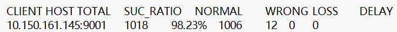

There are two types of errors.

##### *a) Packet Bit Error*

Sender Perspective (WRONG):

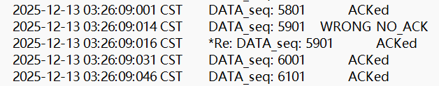

Receiver Perspective:

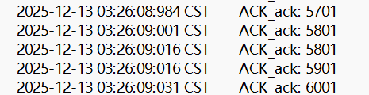

As seen, due to a bit error, the receiver retransmitted the last successfully received ACK, i.e., `ACK_ack: 5801`.

##### *b) ACK Bit Error*

Sender Perspective:

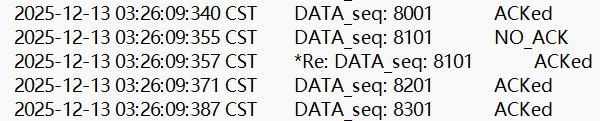

Receiver Perspective (WRONG):

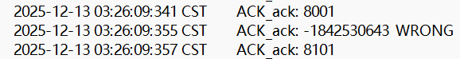

It can be seen that the sender retransmitted the Packet because it received an erroneous ACK.

Additionally, a coincidence occurred where both the packet sent by the sender and the ACK sent by the receiver suffered bit errors:

Sender Perspective (WRONG):

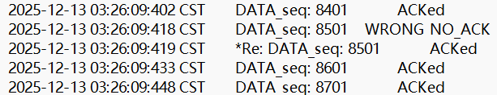

Receiver Perspective (WRONG):

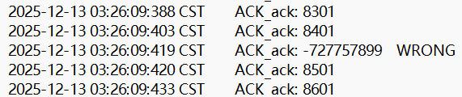

Because the sent packet had a bit error, the ACK returned by the receiver should have been 8401, but this ACK also had a bit error. Consequently, the receiver retransmitted the packet for the next sequence number after that ACK, i.e., 8501 (Note: In standard RDT logic, if the ACK is corrupted, the sender retransmits. The description here reflects the observation from the provided logs).

Through the above examples, it shows that I have been able to handle ACK bit errors by retransmitting packets, conveying packet error/duplicate information solely by sending ACKs, thus implementing RDT 2.2.

---

### *C. RDT 3.0*

A timeout retransmission mechanism was added to the sender, effectively solving the packet loss problem.

#### *1) Code*

##### *a) TCP_Sender.java*

*Public Area:*

```java
UDT_Timer udt_timer;
```

*rdt_send Method:*

```java
public void rdt_send(int dataIndex, int[] appData) {

    // Generate TCP packet (set sequence number and data field/checksum), pay
    // attention to packing order
    tcpH.setTh_seq(dataIndex * appData.length + 1);
    tcpS.setData(appData);
    tcpPack = new TCP_PACKET(tcpH, tcpS, destinAddr);

    tcpH.setTh_sum(CheckSum.computeChkSum(tcpPack));
    tcpPack.setTcpH(tcpH);

    // Send TCP packet
    udt_send(tcpPack);
    udt_timer = new UDT_Timer();
    udt_timer.schedule(new UDT_RetransTask(client, tcpPack), 3000, 3000);


    flag = 0;

    waitACK();
}
```

Every time a `tcpPack` is sent, a new timer is initialized, and a schedule is set to execute `new UDT_RetransTask(client, tcpPack)` every 3000ms, i.e., timeout retransmission.

*waitACK Method:*

```java
public void waitACK() {
    while (flag == 0) {
        if (!ackQueue.isEmpty()) {
            int currentAck = ackQueue.poll();
            if (currentAck == tcpPack.getTcpH().getTh_seq()) {
                System.out.println("Clear: " + tcpPack.getTcpH().getTh_seq());
                flag = 1;
                udt_timer.cancel();
//			} else {
//				System.out.println("Retransmit: " + tcpPack.getTcpH().getTh_seq());
//				udt_send(tcpPack);
//				flag = 0;
            }
        }
    }
}
```

For `waitACK`, if an ACK with the expected sequence number is received, the timer is destroyed. If an unexpected one is received, nothing is done. In my first version of the code, I implemented a retransmission mechanism for receiving unexpected ACKs (the commented-out code) to improve efficiency, similar to TCP's "Fast Retransmit".

##### *b) TCP_Receiver.java* 

Same as RDT 2.2.

---

#### *2) Log Analysis*

RDT 3.0 uses the timeout retransmission mechanism to solve bit error, packet loss, and delay problems. Therefore, the `eFlag` for both sender and receiver is set to 7, meaning bit errors/loss/delays can all occur.

The log file of the run results is shown below. There are a total of 1019 lines, with a success rate of 98.14% and a total of 19 exceptions.

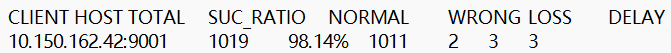

##### *a) Packet/ACK Bit Error*

Sender Perspective (WRONG):

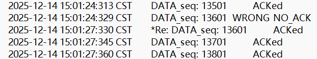

Receiver Perspective:

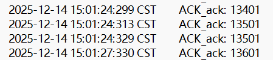

Sender Perspective:

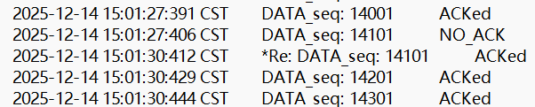

Receiver Perspective (WRONG):

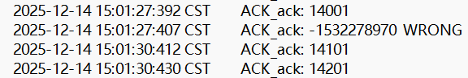

For bit error problems, both Packet and ACK bit errors result in the sender receiving an ACK that does not match the expected sequence number. These are ignored, thereby triggering timeout retransmission.

##### *b) Packet/ACK Loss*

Sender Perspective (LOSS):

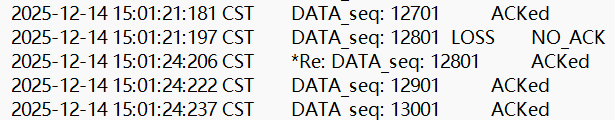

Receiver Perspective:

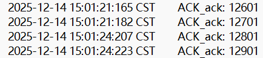

Sender Perspective:

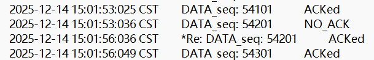

Receiver Perspective (LOSS):

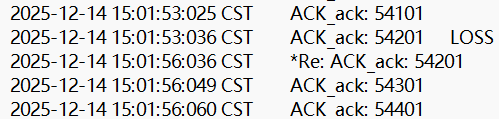

Due to packet loss, the receiver does not respond, and the sender does not receive an ACK, thus triggering timeout retransmission. The same applies to ACK loss.

##### *c) Packet/ACK Delay*

Sender Perspective (DELAY):

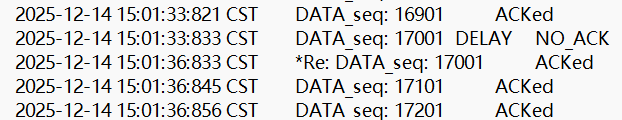

Receiver Perspective:

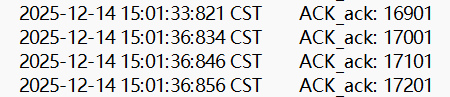

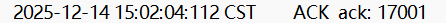

Sender Perspective:

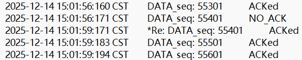

Receiver Perspective (DELAY):

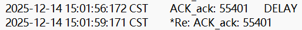

For delay problems, since RDT 3.0 compares the currently expected sequence number with the received ACK, any ACK arriving late due to delay is ignored if its sequence number does not match the current one; if it matches, the expected sequence number is updated, thus ignoring the ACK returned by the retransmitted packet.

Regarding delay at the sender and receiver, the only difference is that the sender ignores any late-arriving ACKs, while the receiver replies with an ACK bearing the same sequence number for a delayed Packet, although it will eventually be ignored by the sender as well.

Through the above examples, it shows that I have been able to use the sender's timeout retransmission mechanism to solve bit error, packet loss, and delay problems, implementing RDT 3.0.

---

### *D. GBN*

#### *1) Code*

##### *a) TCP_Sender.java*

*Public Area:*

```java
// GBN needed
private UDT_Timer udt_timer;
private int windowSize = 4;
private List<TCP_PACKET> unAckedPackets = new ArrayList<TCP_PACKET>();
```

*rdt_send Method:*

```java
public void rdt_send(int dataIndex, int[] appData) {

    // wait for spare window
    while (unAckedPackets.size() >= windowSize);

    try {
        TCP_HEADER newTcpH = tcpH.clone();
        newTcpH.setTh_seq(dataIndex * appData.length + 1);

        TCP_SEGMENT newTcpS = tcpS.clone();
        newTcpS.setData(appData);
        tcpPack = new TCP_PACKET(newTcpH, newTcpS, destinAddr);

        newTcpH.setTh_sum(CheckSum.computeChkSum(tcpPack));
        tcpPack.setTcpH(newTcpH);

        unAckedPackets.add(tcpPack);
        udt_send(tcpPack);

        // Sender has one timer for the oldest unackedpacket
        if(udt_timer==null) {
            udt_timer = new UDT_Timer();
            udt_timer.schedule(new UDT_RetransTask(client, tcpPack), 3000, 3000);
        }
    } catch (CloneNotSupportedException e) {
        e.printStackTrace();
    }
}
```

For the `rdt_send` method, since GBN allows sending multiple packets within the window limit, it is necessary to restrict whether new packets can begin sending here. Because the original `tcpH` and `tcpS` are global variables, they must be cloned to implement the sending of multiple packets. Furthermore, GBN only times the ACK wait time for the earliest sent packet. Once a timeout occurs, all packets in the `unAckedPackets` list are retransmitted. The implementation of retransmission is seen in the `TaskPacketsRetrans` class.

*recv Method:*

```java
public void recv(TCP_PACKET recvPack) {

    // rdt_rcv(rcvpkt) && notcorrupt(rcvpkt)
    if (CheckSum.computeChkSum(recvPack) == recvPack.getTcpH().getTh_sum()) {
        int ack = recvPack.getTcpH().getTh_ack();
        System.out.println("Receive ACK Number： " + ack);
        boolean isAckNew = false;
        while ((!unAckedPackets.isEmpty()) && unAckedPackets.get(0).getTcpH().getTh_seq() <= ack) {
            unAckedPackets.remove(0);
            isAckNew = true;
        }
        if (isAckNew) {
            udt_timer.cancel();
            if (!unAckedPackets.isEmpty()) {
                udt_timer = new UDT_Timer();
                udt_timer.schedule(new TaskPacketsRetrans(client, unAckedPackets), 3000, 3000);
            } else {
                udt_timer = null;
            }
        }
    }
}
```

For GBN, multiple packets are in transit. Therefore, the original `waitACK` method, which could only wait for the ACK of a single packet in a loop, was discarded and replaced by maintaining these ACKs in the `recv` method. The GBN sender only accepts error-free ACKs; erroneous ACKs are ignored. It records the sequence number of the ACK, marks all packets in `unAckedPackets` with sequence numbers prior to this ACK as ACKed, removes them from `unAckedPackets`, and refreshes the timer. If there are still packets in the `unAckedPackets` list, the timeout retransmission schedule needs to be set.

##### *b) TaskPacketsRetrans.java* 

```java
public class TaskPacketsRetrans extends TimerTask{
	private Client senderClient;
	private List<TCP_PACKET> unAckedPackets;
	
	public TaskPacketsRetrans(Client client, List<TCP_PACKET> packets4Retrans) {
		super();
		senderClient=client;
		unAckedPackets=packets4Retrans;	
	}
	
	@Override
	public void run() {
		
		for (TCP_PACKET pkt : unAckedPackets) {
			System.out.println("Retransmit: " + pkt.getTcpH().getTh_seq());
			senderClient.send(pkt);
		}
	}	
}
```

`TaskPacketsRetrans` is the implementation of retransmitting all packets. It inherits from `TimerTask` and overrides the `run` method to implement retransmission via traversal.

##### *c) TCP_Receiver.java* 

*rdt_recv Method:*

```java
public void rdt_recv(TCP_PACKET recvPack) {
    if (CheckSum.computeChkSum(recvPack) == recvPack.getTcpH().getTh_sum()) {
        int sequence_cur = recvPack.getTcpH().getTh_seq();
        if (sequence_cur == sequence) {
            dataQueue.add(recvPack.getTcpS().getData());				
            // Generate ACK packet
            tcpH.setTh_ack(sequence_cur);
            ackPack = new TCP_PACKET(tcpH, tcpS, recvPack.getSourceAddr());
            tcpH.setTh_sum(CheckSum.computeChkSum(ackPack));
            reply(ackPack);				
            lastack = sequence;
            // expected sequence ++
            sequence += recvPack.getTcpS().getData().length;		
        } else {
            tcpH.setTh_ack(lastack);
            ackPack = new TCP_PACKET(tcpH, tcpS, recvPack.getSourceAddr());
            tcpH.setTh_sum(CheckSum.computeChkSum(ackPack));
            // Reply ACK packet
            reply(ackPack);
        }		
    } else {			
        // default reply
        tcpH.setTh_ack(lastack);
        ackPack = new TCP_PACKET(tcpH, tcpS, recvPack.getSourceAddr());
        tcpH.setTh_sum(CheckSum.computeChkSum(ackPack));
        // Reply ACK packet
        reply(ackPack);
    }
    // Deliver data (deliver every 20 groups of data)
    if (dataQueue.size() == 20)
        deliver_data();
}
```

The Receiver needs to record the expected sequence number (must be sequential, following the previous expected sequence number) to filter out out-of-order packets. If an out-of-order or corrupted packet is encountered, it replies with the ACK of the previous expected sequence number; if the expected packet is encountered, it replies with the current expected sequence number and updates it.

---

#### *2) Log Analysis*

The log file of the run results is shown below. There are a total of 1040 lines, with a success rate of 95.48% and a total of 40 exceptions.

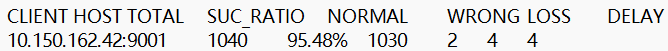

Because GBN has extremely high requirements for packet order, any bit error, packet loss, or delay during transmission causes the receiver to reject out-of-order packets and continue replying with the ACK of the currently confirmed maximum sequence number. Therefore, I analyze the Log file from both receiver and sender perspectives.

##### *a) Sender Bit Error/Loss/Delay*

Sender Perspective:

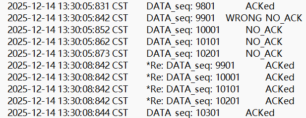

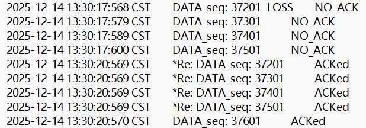

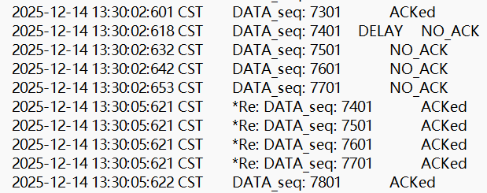

Receiver Perspective:

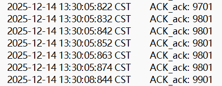

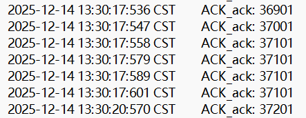

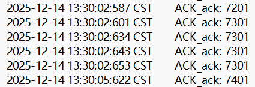

As shown in the figures, sender bit error, loss, or delay caused the packets to arrive out of order at the receiver (or effectively appear so due to loss/corruption), causing the sender to continuously reply with the ACK of the currently confirmed maximum sequence number. Then, GBN timeout retransmission was triggered, retransmitting all packets in `unAckedPackets`.

Furthermore, for bit errors, the sender will receive the erroneous packet and reply with an ACK; for packet loss, the sender will not receive the packet and thus will not reply with an ACK; for delay, the sender will reply after the delayed packet eventually arrives, replying with the ACK of the currently confirmed maximum sequence number.

##### *b) Receiver Bit Error/Loss/Delay*

Sender Perspective:

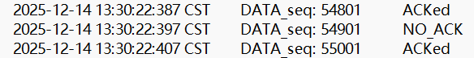

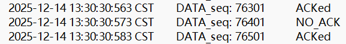

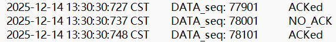

Receiver Perspective:

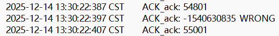

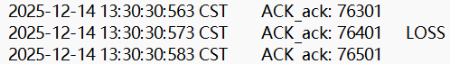

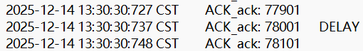

Receiver bit error/loss/delay only affects whether the ACK for a certain packet is received by the sender; it does not affect the transmission of subsequent packets because the receiver has received that ACK (internally/logically processed) and updated the expected sequence number (Cumulative ACK).

Through the above examples, it shows that I have implemented cumulative acknowledgment, thus implementing GBN.

---

### *E. SR*

#### *1) Code*

##### *a) TCP_Sender.java*

*Public Area:*

```java
// SR needed
private UDT_Timer udt_timer;
private int windowSize = 4;
private ConcurrentSkipListMap<Integer, TCP_PACKET> unAckedPackets = new ConcurrentSkipListMap<Integer, TCP_PACKET>();
private ConcurrentSkipListMap<Integer, UDT_Timer> timers = new ConcurrentSkipListMap<Integer, UDT_Timer>();
```

After repeated testing, I decided to use the `ConcurrentSkipListMap` data structure to store `TCP_PACKET`s and corresponding timers, using their sequence numbers as keys. This data structure is essentially a multi-layer linked list that can sort based on key values. It has better thread stability compared to Red-Black Trees or Hash Maps. Using this data structure basically resulted in no thread errors, making it suitable for my scenario requiring multi-threaded operations.

*rdt_send Method:*

```java
public void rdt_send(int dataIndex, int[] appData) {

    // wait for spare window
    while (unAckedPackets.size() >= windowSize);

    try {
        TCP_HEADER newTcpH = tcpH.clone();
        newTcpH.setTh_seq(dataIndex * appData.length + 1);

        TCP_SEGMENT newTcpS = tcpS.clone();
        newTcpS.setData(appData);
        tcpPack = new TCP_PACKET(newTcpH, newTcpS, destinAddr);

        newTcpH.setTh_sum(CheckSum.computeChkSum(tcpPack));
        tcpPack.setTcpH(newTcpH);

        unAckedPackets.put(newTcpH.getTh_seq(),tcpPack);
        udt_send(tcpPack);

        udt_timer = new UDT_Timer();
        udt_timer.schedule(new UDT_RetransTask(client, tcpPack), 3000, 3000);
        timers.put(newTcpH.getTh_seq(), udt_timer);	

    } catch (CloneNotSupportedException e) {
        e.printStackTrace();
    }
}
```

The GBN single-timer, retransmit-all mechanism was modified. Instead, a separate timer is set for each packet in `unAckedPackets`. If a timeout occurs, only that specific packet is retransmitted.

*recv Method:*

```java
public void recv(TCP_PACKET recvPack) {

    // rdt_rcv(rcvpkt) && notcorrupt(rcvpkt)
    if (CheckSum.computeChkSum(recvPack) == recvPack.getTcpH().getTh_sum()) {

        int ack = recvPack.getTcpH().getTh_ack();

        System.out.println("Receive ACK Number： " + ack);

        UDT_Timer timer = timers.remove(ack);

        if (timer != null) {
            timer.cancel();
        }

        while(!unAckedPackets.isEmpty()) {
            int base = unAckedPackets.firstKey();
            if(timers.containsKey(base)) {
                break;
            }
            unAckedPackets.remove(base);
        }
    }
}
```

After receiving an ACK, check if the skip list `timers` contains that ACK. If yes, it means it hasn't been ACKed yet; if no, it means it is already ACKed. Thus, remove the ACK from the skip list, regarding the packet as ACKed. Simultaneously, check if the first packet in `unAckedPackets` is already ACKed; if so, move the window. This mechanism is implemented by looping to check if `timers` contains that ACK.

##### *b) TCP_Receiver.java* 

*Public Area:*

```java
private ConcurrentSkipListMap<Integer, int[]> dataBuffer = new ConcurrentSkipListMap<Integer, int[]>();
```

Similarly, `ConcurrentSkipListMap` is used to buffer out-of-order data.

*rdt_recv Method:*

```java
public void rdt_recv(TCP_PACKET recvPack) {
    if (CheckSum.computeChkSum(recvPack) == recvPack.getTcpH().getTh_sum()) {

        int sequence_cur = recvPack.getTcpH().getTh_seq();

        tcpH.setTh_ack(sequence_cur);
        ackPack = new TCP_PACKET(tcpH, tcpS, recvPack.getSourceAddr());
        tcpH.setTh_sum(CheckSum.computeChkSum(ackPack));
        reply(ackPack);

        if (sequence_cur == sequence) {
            dataQueue.add(recvPack.getTcpS().getData());
            // expected sequence ++
            sequence += recvPack.getTcpS().getData().length;

            while (dataBuffer.containsKey(sequence)) {
                int[] data_cur = dataBuffer.get(sequence);
                dataQueue.add(data_cur);
                dataBuffer.remove(sequence);
                sequence += data_cur.length;
            }
        } else if ((sequence_cur > sequence) && (!dataBuffer.containsKey(sequence_cur))) {
            dataBuffer.put(sequence_cur, recvPack.getTcpS().getData());
        }
    }

    // Deliver data
    if (dataQueue.size() >= 1)
        deliver_data();
}
```

For SR, the receiver needs to return an ACK for the sequence number of each received packet, ignoring corrupted packets. It has a base sequence (the `sequence` variable in the code). Only packets with sequence numbers greater than or equal to base are processed: packets with sequence numbers greater than base (out-of-order) are stored in the buffer skip list; packets with sequence numbers equal to base (ordered) are uploaded directly, and the window moves based on data in the skip list.

Since the amount of data in the buffer varies, the data length in `dataQueue` does not necessarily increase by a fixed value each time. Therefore, the original logic of sending every 20 groups was modified to transmit whenever there is data (`dataQueue.size() >= 1`).

---

#### *2) Log Analysis*

`Eflag` is set to 7, meaning bit errors/loss/delays occur at both sender and receiver.

The log file of the run results is shown below. There are a total of 1019 lines, with a success rate of 98.14% and a total of 19 exceptions.

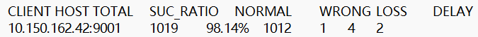

##### *a) Sender Bit Error/Loss/Delay*

Sender Perspective:

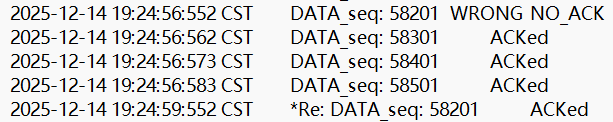

Receiver Perspective:

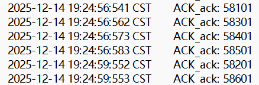

For bit errors occurring during transmission from the sender, the receiver ignores the packet and makes no response, thus triggering timeout retransmission. As seen in the figure, packet 58201 arrived out of order at the sender.

Sender Perspective:

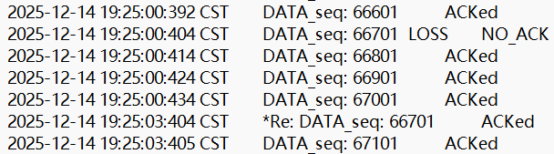

Receiver Perspective:

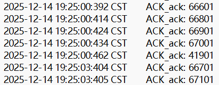

LOSS in sender transmission triggers timeout retransmission.

Sender Perspective:

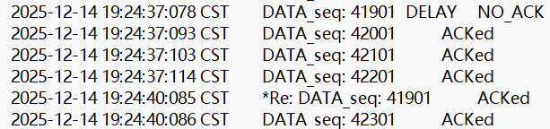

Receiver Perspective:

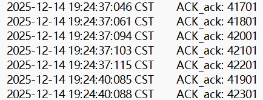

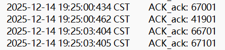

Delayed packets also trigger timeout retransmission. However, upon subsequently receiving the delayed packet, the receiver replies again with an ACK of its sequence number, like ACK 41901 in the figure, though this retransmitted ACK has no effect on the sender.

##### *b) Receiver Bit Error/Loss/Delay*

Sender Perspective:

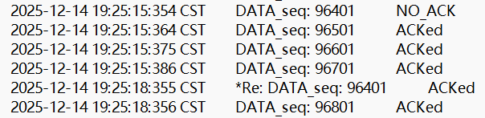

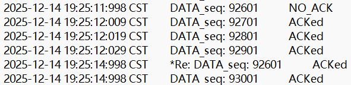

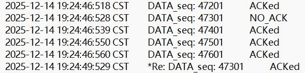

Receiver Perspective:

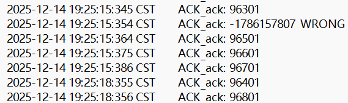

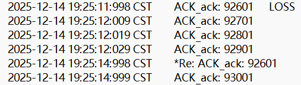


For receiver transmission ACK bit errors/loss/delays, although the receiver successfully received the packet sent by the sender, the sender does not know this, so it retransmits the packet.

Through the above analysis, it shows that I have implemented the buffering of out-of-order packets and implemented SR.

---

### *F. TCP*

#### *1) Code*

##### *a) TCP_Sender.java*

Basic TCP can be approximately understood as a combination of GBN and SR. Therefore, for its sender, my modification is based on GBN.

*Public Area:*

```java
//private ConcurrentSkipListMap<Integer, UDT_Timer> timers = new ConcurrentSkipListMap<Integer, UDT_Timer>();
```

TCP only needs one timer to time the earliest sent packet, so a data structure to store a timer for each packet is no longer needed.

*rdt_send Method:*

```java
if(udt_timer==null) {
    udt_timer = new UDT_Timer();
    udt_timer.schedule(new UDT_RetransTask(client, tcpPack), 3000, 3000);
}
```

TCP timeout retransmission only retransmits the earliest unacknowledged Packet.

*recv Method:*

```java
if (isAckNew) {
    udt_timer.cancel();
    if (!unAckedPackets.isEmpty()) {
        TCP_PACKET basePacket = unAckedPackets.firstEntry().getValue();
        udt_timer = new UDT_Timer();
        udt_timer.schedule(new UDT_RetransTask(client, basePacket), 3000, 3000);
    } else {
        udt_timer = null;
    }
}
```

Since GBN is sequential and retransmits all current packets upon timeout, it suffices to refresh the timer when the sender window moves. TCP, however, needs to get the index of the earliest packet from `unAckedPackets` and set a separate timer for it.

##### *b) TCP_Receiver.java* 

*rdt_recv Method:*

```java
if (CheckSum.computeChkSum(recvPack) == recvPack.getTcpH().getTh_sum()) {

    int sequence_cur = recvPack.getTcpH().getTh_seq();

    if (sequence_cur == sequence) {
        dataQueue.add(recvPack.getTcpS().getData());
        // expected sequence ++
        sequence += recvPack.getTcpS().getData().length;

        while (dataBuffer.containsKey(sequence)) {
            int[] data_cur = dataBuffer.get(sequence);
            dataQueue.add(data_cur);
            dataBuffer.remove(sequence);
            sequence += data_cur.length;
        }
    } else if ((sequence_cur > sequence) && (!dataBuffer.containsKey(sequence_cur))) {
        dataBuffer.put(sequence_cur, recvPack.getTcpS().getData());
    }

    tcpH.setTh_ack(sequence-recvPack.getTcpS().getData().length);
    ackPack = new TCP_PACKET(tcpH, tcpS, recvPack.getSourceAddr());
    tcpH.setTh_sum(CheckSum.computeChkSum(ackPack));
    reply(ackPack);
}
```

The receiver needs to maintain the expected sequence number while buffering out-of-order packets. Therefore, the SR logic was modified to set the ACK after updating the expected sequence number. Here, I encountered an **unsolvable problem**. Traditionally, a TCP receiver should reply with the ACK of the expected sequence number (the smallest unreceived packet). However, testing showed that the underlying logic of the Log file determines whether a packet is ACKed or NO_ACK based on whether the ACK for *that specific packet's sequence number* was sent by the receiver. Thus, achieving both cumulative acknowledgment and replying with the expected ACK is impossible without modifying the underlying logic. To address this, in the code, I made the receiver reply with the sequence number *prior* to the expected sequence number, i.e., `sequence - recvPack.getTcpS().getData().length`, achieving the effect of cumulative acknowledgment. The only impact on the entire TCP system is that the terminal output will no longer display the receipt of the expected sequence number; however, this output can be corrected, for example, by adding `recvPack.getTcpS().getData().length` back before printing.

In the subsequent analysis of the Log file, I will treat the ACK number replied by the receiver as the expected sequence number.

---

#### *2) Log Analysis*

`Eflag` is set to 7, meaning bit errors/loss/delays occur at both sender and receiver.

The log file of the run results is shown below. There are a total of 1008 lines, with a success rate of 96.23% and a total of 38 exceptions.


For all sender exceptions (bit error/loss/delay), subsequent packets in the sending window will show NO_ACK. This is because the receiver persistently replies with the sequence number of the expected Packet (which is the sequence number of the exception packet). Although NO_ACK is displayed, as long as subsequent packets transmit without exception, they will be buffered by the receiver, so it is not a major issue. Then, timeout retransmission is triggered, and operations like window movement are executed upon receiving the ACK. Sender exceptions and processing are shown below.


The sender window size is 4. Here, a suspicious point is easily found: the packet *before* the retransmitted exception packet is actually ACKed, not NO_ACK. Looking from the receiver side, it seems the ACK for that packet was affected by the ACK of the retransmitted packet, making that packet appear ACKed.


As seen in the figure, at 14:31:56:092, the receiver replied with `ACK_ack 101` for packet 501 (telling the sender the expected Packet sequence is 201). Then, at 14:31:59:037, for the retransmission of packet 201, it replied with `ACK_ack 501` (telling the sender the expected Packet sequence is 601). Therefore, the log shows no problem with the ACKs sent back by the receiver. The problem likely lies in the ACK determination mechanism of the sender's log file. This is slightly abnormal, but after asking other students, I found everyone encountered this issue, so I did not pursue it further, as this anomaly does not affect code execution.

For receiver transmission ACK exceptions (bit error/loss/delay), due to the cumulative acknowledgment mechanism, the sender will not retransmit these NO_ACK packets.

Receiver Perspective:


Sender Perspective:


As seen in the figure, for NO_ACK packets, since subsequent Packets received ACKs, the sender will no longer process them via timeout retransmission but will skip them directly and move the window.

Thus, I have implemented basic TCP.

---

### *F. TCP Tahoe*

TCP Tahoe adds Slow Start (exponential growth), Congestion Avoidance (additive increase), and Fast Retransmit (triggering multiplicative decrease; timeout also triggers multiplicative decrease) to the basic TCP.

#### *1) Code*

These new mechanisms all restrict the capacity of the `cwnd` window, so only the sender needs modification. Additionally, since the original timeout retransmission method `UDT_RetransTask` in the library cannot modify `cwnd` capacity and `ssthresh`, the timeout retransmission method needs to be rewritten. In GBN, I wrote a `TaskPacketsRetrans` class; here, only slight modifications to this class are needed to achieve the desired functionality.

##### *a) TCP_Sender.java*

*Public Area:*

```java
public volatile double windowSize = 1.0; //cwnd
public volatile int ssthresh = 16;
private int lastAck = -1;
private int dupAckCount = 0;
```

Since `cwnd` and `ssthresh` need to be modified in an external class and multi-threadedly, both variables are decorated with `public volatile`. For `windowSize`, since division is involved in the congestion avoidance phase, the variable type is `double`. For `ssthresh`, its initial value is set to 16.

`lastAck` and `dupAckCount` are two auxiliary variables used to judge whether duplicate ACKs are received to implement Fast Retransmit.

*rdt_send Method:*

```java
udt_timer.schedule(new TaskPacketsRetrans(client, tcpPack, this), 3000, 3000);
```

*recv Method:*

```java
if(lastAck < ack) {
    lastAck = ack;
    dupAckCount = 0;
}else if(lastAck == ack) {
    dupAckCount ++;
    System.out.println("Tahoe Event: "+dupAckCount +" Duplicate ACKs.");
}

if(dupAckCount == 3) {
    ssthresh = Math.max((int)windowSize / 2, 2);
    windowSize=1.0;
    System.out.println("Resetting cwnd = "+(int)windowSize);
    System.out.println("Tahoe Event: Multiplicative Decrease. Resetting ssthresh = "+ssthresh);
    // Fast Retransmit
    if (!unAckedPackets.isEmpty()) {
        TCP_PACKET lostPacket = unAckedPackets.firstEntry().getValue();
        udt_send(lostPacket);
//		udt_timer.cancel();
//		udt_timer = new UDT_Timer();
//		udt_timer.schedule(new TaskPacketsRetrans(client, lostPacket, this), 3000, 3000);
    }
    return;
}
```

Fast Retransmit was added, implemented by checking for three consecutive identical ACKs. `lastAck` and `dupAckCount` serve as auxiliary variables. Once `dupAckCount` accumulates to 3, Fast Retransmit is triggered, setting `cwnd` capacity to 1 and `ssthresh` to half the current value. Then, the first Packet in the `unAckedPackets` table is retransmitted. Regarding the timer, whether it is refreshed here does not affect code execution, so to save space, I commented out the original few lines of timer reset logic in the latest code.

However, the experiment requirements **did not require TCP Tahoe to implement Fast Retransmit**, placing this feature in **TCP Reno** instead. Therefore, I will comment out this part of the code in subsequent testing, letting TCP Tahoe handle unreceived expected ACKs solely via timeout retransmission mechanisms.

```java
if (isAckNew) {
    udt_timer.cancel();
    if (!unAckedPackets.isEmpty()) {
        TCP_PACKET basePacket = unAckedPackets.firstEntry().getValue();
        udt_timer = new UDT_Timer();
        udt_timer.schedule(new TaskPacketsRetrans(client, basePacket, this), 3000, 3000);
    } else {
        udt_timer = null;
    }
    if(windowSize < ssthresh) {
        windowSize += 1.0;
        System.out.println("Slow start, cwnd = " + (int)windowSize);
    } else {
        windowSize += 1.0 / (int)windowSize;
        if (windowSize - (int)windowSize > 0.999) {
            windowSize = Math.ceil(windowSize);
        }
        System.out.println("Congestion Avoidance, cwnd = " + (int)windowSize);
    }
}
```

Slow Start and Congestion Avoidance were added. For Congestion Avoidance, since `double` division loses precision (e.g., 1/7*7 < 1), a threshold check is performed here. If the decimal part of the calculation exceeds 0.999, it is treated as 1, and the `cwnd` capacity is rounded up.

##### *b) TaskPacketsRetrans.java*

```java
public class TaskPacketsRetrans extends TimerTask{
	private Client senderClient;
	//private List<TCP_PACKET> unAckedPackets;
	private TCP_PACKET packet4Retrans;
	private TCP_Sender sender;
	
	public TaskPacketsRetrans(Client client, TCP_PACKET packet4Retrans, TCP_Sender sender) {
		super();
		senderClient=client;
		this.packet4Retrans=packet4Retrans;	
		this.sender = sender;
	}
	
	@Override
	public void run() {
		senderClient.send(packet4Retrans);		
		sender.ssthresh = Math.max((int)sender.windowSize / 2, 2);
		sender.windowSize = 1.0;
		System.out.println("Tahoe Event: Timeout. Resetting cwnd = "+(int)sender.windowSize);
		System.out.println("Tahoe Event: Multiplicative Decrease. Resetting ssthresh = "+sender.ssthresh);
//		for (TCP_PACKET pkt : unAckedPackets) {
//			System.out.println("Retransmit: " + pkt.getTcpH().getTh_seq());
//			senderClient.send(pkt);
//		}
	}	
}
```

This class's method is called during sender timeout retransmission. The class (originally from GBN) was modified. The constructor now accepts `TCP_Sender` as a parameter, enabling modification of the sender's public variables `windowSize` (cwnd capacity) and `ssthresh` from this class. In the `run` method, the packet is retransmitted, and `cwnd` capacity and `ssthresh` are modified to implement multiplicative decrease.

---

#### *2) Terminal and Log Analysis*

In the code, I added prints for various `cwnd` states, so I will analyze TCP Tahoe combining terminal output and Log files.

##### *a) Slow Start*


As seen from the terminal output, before `cwnd` capacity reaches `ssthresh`, after three RTT rounds, `cwnd` size increases from 1 to 2, then to 4, exhibiting exponential growth.

##### *b) Congestion Avoidance*


As shown in the figure, after `cwnd` capacity reaches `ssthresh`, the capacity increases additively (linearly), increasing by only 1 per RTT round. Only after ending an RTT round (i.e., sending non-duplicate packets and receiving corresponding ACKs `cwnd` capacity times) does `cwnd` capacity become 17, as shown below:


Thus, Congestion Avoidance is implemented.

##### *c) Timeout Retransmission*

Since TCP Tahoe includes Fast Retransmit, the time required to trigger Fast Retransmit and receive ACKs is far less than that for timeout retransmission. Therefore, I decided to **comment out the original TCP Tahoe Fast Retransmit code** to test timeout retransmission.


Starting from when the sender sends the packet with sequence number 38101, the receiver replies with an abnormal ACK 37901 (expected 38001), indicating that packet 38001 is abnormal. Judging from the log file, this is indeed the case:


Packet 38001 was lost, and other packets in that window are also NO ACK:


After 3 seconds, the sender's timer triggers timeout retransmission, sets `cwnd` capacity to 1, performs multiplicative decrease on `ssthresh` (originally 15, rounded down to 7), and subsequently, `cwnd` begins slow start, restoring normality.

Thus, I have implemented TCP Tahoe (Fast Retransmit will be tested in the TCP Reno section).

---

### *F. TCP Reno*

TCP Reno adds Fast Recovery on top of TCP Tahoe.

In the experiment requirements, TCP Tahoe's **Fast Retransmit** mechanism was required to be presented in this section. However, in the TCP Tahoe section, we **already implemented Fast Retransmit** and explained the code. Therefore, the TCP Reno code section will not repeat the explanation of Fast Retransmit, but the Terminal and Log Analysis section will analyze it.

#### *1) Code*

Fast Recovery was added: When receiving three duplicate ACKs, TCP Reno sets the current `ssthresh` value to half of the current `cwnd`, but does not return to Slow Start state. Instead, it enters Fast Recovery state: setting `cwnd` to (updated) `ssthresh` + 3MSS. If duplicate ACKs continue, implying another data packet (albeit out-of-order) has reached the receiver buffer, `cwnd` continues to increase linearly. Unlike additive increase, Fast Recovery's `cwnd` is linear with respect to the number of duplicate packets, not RTT. If a timeout occurs, it enters Slow Start state; if a new ACK is received, it restores `cwnd` to `ssthresh` and enters Congestion Avoidance.

Therefore, only TCP Tahoe's `recv` Method needs modification.

*recv Method:*

```java
if(lastAck < ack) {
    if (dupAckCount>=3) {
        windowSize=ssthresh;
        System.out.println("Reno Event: Exit Fast Recovery. Resetting cwnd = "+(int)windowSize);
    }
```

Added Fast Recovery exit: when a new ACK is received, restore `cwnd` capacity to `ssthresh`.

```java
ssthresh = Math.max((int)windowSize / 2, 2);
				windowSize=ssthresh+3;
				System.out.println("Reno Event: Fast Recovery. Resetting cwnd = "+(int)windowSize);
				System.out.println("Reno Event: Multiplicative Decrease. Resetting ssthresh = "+ssthresh);
```

Changed `cwnd` (windowSize) from the original slow start value of 1 to `ssthresh + 3`, thereby entering Fast Recovery.

```java
if(dupAckCount > 3) {
    windowSize++;
    System.out.println("Reno Event: New duplicate ACK. Increasing cwnd = "+(int)windowSize);
}
```

After entering Fast Recovery, if duplicate packets continue to be received (usually caused by exceptions in the fast retransmitted packet), increase `cwnd` capacity.

Thus, the entry, inflation during, and exit of Fast Recovery are implemented, achieving TCP Reno.

---

#### *2) Terminal and Log Analysis*

##### *a) Fast Retransmission*


When the sender receives three duplicate ACKs, Fast Retransmit is triggered. As shown, the packet with sequence number 56701 is fast retransmitted.


The sender retransmits the expected packet, then enters Fast Recovery state.


Because transmission speed is fast, the sender immediately received a new ACK, causing it to exit Fast Recovery immediately; it was very brief.

##### *b) Fast Recovery*

To thoroughly test the Fast Recovery state, I ran the program multiple times until encountering a situation where the fast retransmitted packet also failed. In this case, Fast Recovery can only be exited via timeout retransmission.


As shown, packet 70601 had a bit error. After the sender received three duplicate ACKs for 70501 (expected 70601), timeout retransmission was triggered, but the retransmitted packet 70601 also had a bit error.


This caused the sender to continuously receive ACKs for sequence number 70501 (expected 70601) for the next 3 seconds (timer triggers timeout retransmission after 3 seconds), and `cwnd` capacity kept increasing.


Eventually, `cwnd` size increased to a staggering 287. Then, at this moment, timeout retransmission was triggered, retransmitting the previously abnormal fast retransmitted packet. Thereby, it exited Fast Recovery state and entered Slow Start.


During Fast Recovery, if the ACK replied by the receiver is abnormal, the sender takes no action, i.e., does not increase `cwnd` capacity, as shown above.

Due to fast transmission speed, `cwnd` capacity usually has surplus when just entering Fast Recovery and is basically unaffected unless `cwnd` capacity runs out. This would cause the program to block for a while, only exiting blocking via waiting for timeout retransmission. During my multiple test runs, I basically did not encounter program blocking due to insufficient `cwnd` capacity during Fast Recovery.


However, if the Packet sent by the sender is abnormal, it can only trigger timeout retransmission sequentially to handle the abnormal packet. When the first fast retransmitted abnormal packet triggers timeout retransmission, the program exits Fast Recovery state and enters Slow Start. At this time, `cwnd` capacity is set to 1, so no new Packets will be sent.


So, for abnormal packets transmitted by the sender during Fast Recovery, they will not trigger Fast Retransmit (cannot receive three duplicate ACKs). They can only wait one by one for this single timer to refresh and trigger timeout retransmission. Finally, only after each abnormal packet is processed via timeout retransmission does `cwnd` have capacity, allowing sending to continue.

Thus, I have implemented Fast Retransmission and Fast Recovery, implementing TCP Reno.

---


## II. For items not fully completed, explain the key difficulties encountered during completion and possible solutions. (2 points) 

***A. TCP Section: Conflict between Expected ACK and Log Document***

In the GBN section, the ACK replied by the receiver is the ACK of the maximum sequence number of the packet currently received. However, TCP generally replies with the expected ACK, i.e., the ACK of the sequence number of the packet not yet received. This causes the cumulative acknowledgment logic of the two to differ.


The Log file, after testing, is quite strict regarding ACK sequence numbers. If the sequence number of the replied ACK is different from the sent Packet, a complete NO_ACK situation appears, as shown above. Therefore, the problem appeared where GBN's cumulative acknowledgment Log file display is normal while TCP's is abnormal (the original log logic adapts to GBN). I had to make TCP reply with the ACK of the sequence number preceding the expected sequence number.

```java
tcpH.setTh_ack(sequence-recvPack.getTcpS().getData().length);
```

`sequence` is the calculated expected sequence number; subtracting the data length of each segment gives its previous sequence number.

However, doing this requires us to correct the sequence number when considering problems, i.e., adding the data length back to get the expected sequence number.

I believe there are three solutions:

1. Rewrite a new log file specifically for TCP, making it judge whether the packet is ACKed from the perspective of the sender accepting ACKs.
2. Reprocess the generated log file, which might be troublesome and involve more workload than the first method.
3. Access the underlying code. The original experiment framework is already compiled, meaning we cannot modify the original logic unless the teacher provides the underlying code for direct adjustment.

***B. TCP Section: Log Display Anomaly for Packet Preceding Timeout/Fast Retransmit*** 

Similarly, the Log file shows an anomaly, as shown below.


Before the fast retransmission of packet 27501, theoretically, packet 27801 should only receive ACKs for sequence number 27401 (expected 27501), so it should not be ACKed. Obviously, the Log file display is abnormal.

The solution is the same as the previous problem.

------


## III. Explain the advantages or problems of adopting iterative development during the experiment. (Reasonable advantages or problems: 1 point) 

***A. Advantages***

It allowed me to deeply understand every stage of development from RDT to TCP, their changes, characteristics, and implementation details. For example: I mistakenly thought RDT 3.0 also needed retransmission for checksum failures/duplicate ACKs, but later, after consulting the PPT, I found that RDT 3.0 handles exceptions solely through timeout retransmission.

It allows continuous trial and error and debugging. One does not spend too much energy because modifying a line of code causes the program to fail, because code modification is based on code that already runs. This makes it easy to find problems and saves time.

***B. Problems***

Maintenance is relatively difficult, easily turning into "patch-style" programming. For instance, my method of adding Fast Recovery to TCP Reno involved adding more `if-else` statements to the TCP Tahoe code, deepening the nesting. If the change between two versions is large, such as from RDT 3.0 to GBN, the old code architecture can easily fail to support it, requiring significant adjustment and refactoring to implement iterative development. In such cases, it is better to overthrow the original logic and rewrite the code framework.

------


## IV. Summarize the main problems solved during the major assignment and the corresponding solutions you adopted. (1 point) 

***A. Code Structure and Blocking Issues (RDT 2.0)***

   - **Problem:** The original `rdt_send` method contained a dead loop that blocked execution improperly.
   - **Solution:** Refactored the code by moving the loop into the `waitACK` method and calling `waitACK` inside `rdt_send`, allowing for a proper stop-and-wait mechanism.

***B. Object Reference Handling (GBN)***

   - **Problem:** Since `tcpH` and `tcpS` are global variables, modifying them for new packets affected previous packets in the buffer.
   - **Solution:** Used the `.clone()` method when creating new `TCP_PACKET` instances in `rdt_send` to ensure each packet in the window maintained its unique header and data.

***C. Thread Safety and Data Structure Stability (SR)***

   - **Problem:** Standard maps caused thread safety errors during multi-threaded operations (timers and packet handling).
   - **Solution:** Adopted `ConcurrentSkipListMap` for storing `unAckedPackets`, `timers`, and `dataBuffer`. This provided thread stability and automatic sorting by sequence number.

***D. Log System Compatibility regarding ACK Numbers (TCP)***

   - **Problem:** The experimental Log system logic conflicts with standard TCP; it expects the ACK of the *received* packet sequence, whereas standard TCP sends the *expected* next sequence. This caused the Log to show "NO_ACK" errors.
   - **Solution:** Modified the Receiver to reply with `sequence - length` (the last successfully received byte's sequence) instead of the expected sequence. This simulated cumulative acknowledgment while satisfying the Log system's verification logic.

***E. Floating Point Precision in Congestion Avoidance (TCP Tahoe/Reno)***

   - **Problem:** When calculating `windowSize += 1.0 / windowSize` using `double` type, precision loss occurred (e.g., resulting in 0.999 instead of 1.0), preventing the window from increasing correctly.
   - **Solution:** Added a threshold check. If the decimal part of the calculated window size exceeds 0.999, `Math.ceil()` is used to force an upward integer rounding.

***F. Modifying Sender State from Timer Tasks (TCP Tahoe/Reno)***

   - **Problem:** The `UDT_RetransTask` (external class) needed to modify `cwnd` and `ssthresh` upon timeout, but didn't have access.
   - **Solution:** Customized the `TaskPacketsRetrans` constructor to accept the `TCP_Sender` instance (`this`), allowing the timer thread to directly update the sender's public congestion control variables.

------


## V. Raise questions or suggestions regarding the experimental system. (1 point) 

- The CRC32 library is imported before the checksum function, but the checksum field defined in RFC 793 is implemented by summation and inversion. Therefore, I believe CRC32 verification should not be used here, and I hope the teacher can clarify the requirements for this part.
- I hope the teacher can provide the underlying code, especially for the Log file, to facilitate our debugging. I also hope to adjust the writing logic of the Log file; I have detailed two problems related to the Log file earlier.
- The experiment requirements are a bit vague. For example: it was not stated which part needs to test which `eFlag`, so I adjusted `eFlag` for testing entirely based on the characteristics of that version; for TCP, it was not stated what content needs to be printed on the terminal, so I had to print states as much as possible according to standards that achieve debugging effects.
- The data part of the terminal output information for the already written Sender and Receiver is a bit redundant and takes up too much space. I actually only focused on the packet and ack sequence numbers; I feel it is unnecessary to print data here, as the `recvdata` line count is sufficient to judge whether data transmission is normal.

